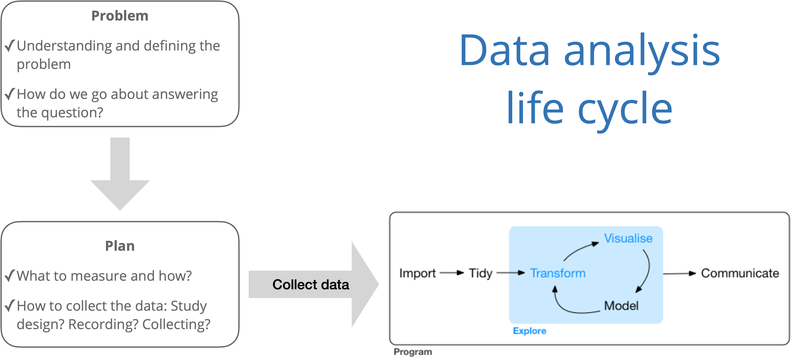

```{r load-packages, include=FALSE}
library(tidyverse)
```

## Announcements 

- Office hours start today. Schedule available on the [syllabus](https://sta199-fa21-003.netlify.app/syllabus/).

- Complete [All About You survey](https://duke.qualtrics.com/jfe/form/SV_1M8MJovNzBNyMYK) by Wednesday 

- [Week 03](https://sta199-fa21-003.netlify.app/prepare/week-03.html) prepare

- Lab 01 **due today at 11:59p**
  - *This assignment only* - Accepted late (until Sep 02 at 11:59p) with no penalty
  
## Questions about lab? 

## Data analysis life cycle 

```{r echo = F, fig.cap = "Data science life cycle from [*R for Data Science*](https://r4ds.had.co.nz/) with modifications from *The Art of Statistics: How to Learn from Data*", out.width = "70%", fig.align = "center"}

```

## Examining data visualization (~ 5 min) 

Discuss the following for the visualization below. 

- What is the visualization trying to show?
- What is effective, i.e. what is done well? 
- What is ineffective, i.e. what could be improved? 
- What are you curious about after looking at the visualization? 

```{r echo = F, fig.align = "center", fig.cap = "Figure originally seen on  [Twitter](https://twitter.com/reina_sabah/status/1291509085855260672)."}
knitr::include_graphics("img/female-heights.png")
```

## Questions from prepare assignment?

## AE-03: Data Visualization

## Clone a repo + start a new project

- Go to the `ae-03-[GITHUB USERNAME]` rep in the GitHub course organization:  https://github.com/sta199-fa21-003

- Access the RStudio Docker containers at https://vm-manage.oit.duke.edu/containers

- See the [Lab 01 instructions](https://sta199-fa21-003.netlify.app/labs/lab-01-hello-r.html) for details on cloning the repo and starting a new project in RStudio. 

