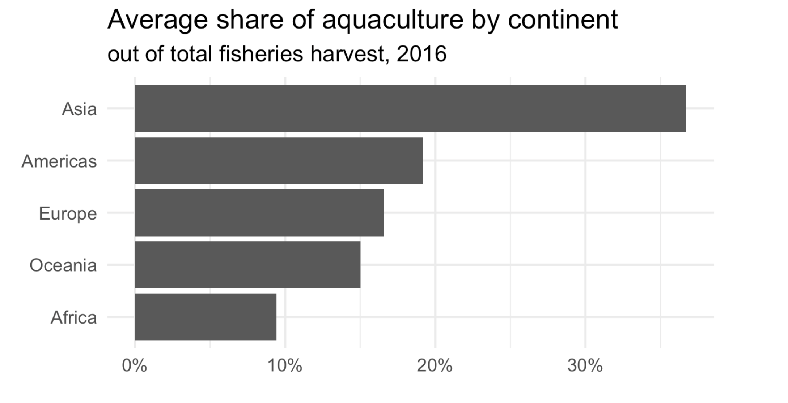

```{r load-packages, include = FALSE }
library(tidyverse)
```

## Announcements

- Lab 03 due **today at 11:59p**

- HW 01 due **Wednesday, September 15 at 11:59p**

- Ed Discussion board for today's lecture: https://edstem.org/us/courses/8027/discussion/605904

- [Week 05](https://sta199-fa21-003.netlify.app/prepare/week-05.html) prepare
  - Prep Quiz 02 due Monday, September 20 at 1:45p

## Questions about lab or HW? 

## Questions from prepare assignment? 

## Coding style & workflow

- Avoid long lines of code. 
  - We should be able to see <u>all</u> of your code.
- Name code chunks.
- Knit, commit, and push regularly. 
  - Think about it like clicking to save regularly as you type a report.
- Label your code chunks. Do **not** put spaces in the code-chunk names.


## AE 07: Aquaculture production by continent

**Goal**: Join data from multiple data frames, summarize it, and create this plot.



### Clone the repo + start a new project

- Go to the `ae-07-[GITHUB USERNAME]` rep in the GitHub course organization:  https://github.com/sta199-fa21-003

- Access the RStudio Docker containers at https://vm-manage.oit.duke.edu/containers

- See the [Lab 01 instructions](https://sta199-fa21-003.netlify.app/labs/lab-01-hello-r.html) for details on cloning the repo and starting a new project in RStudio. 


