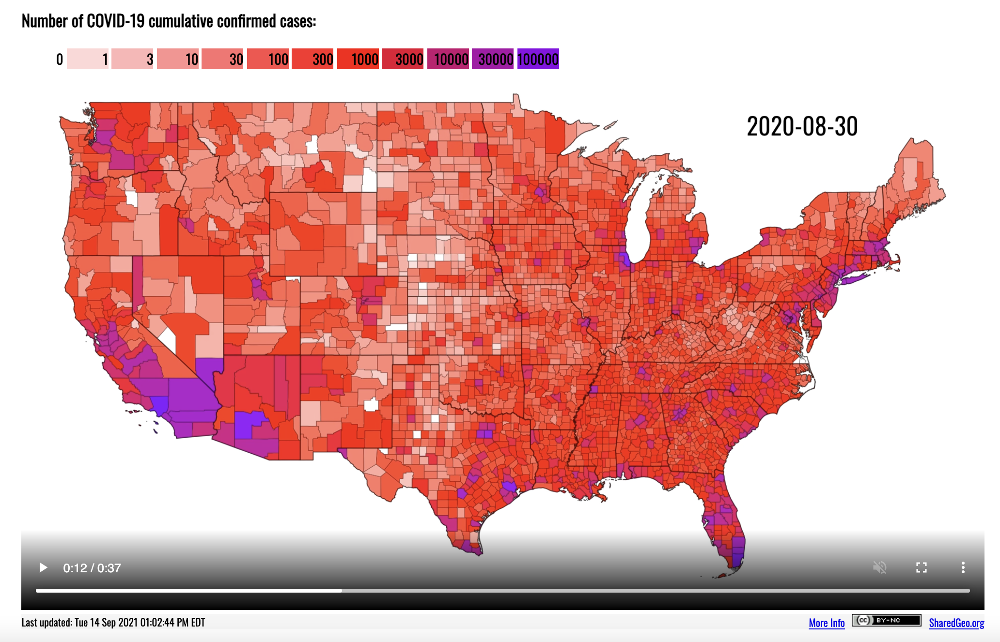
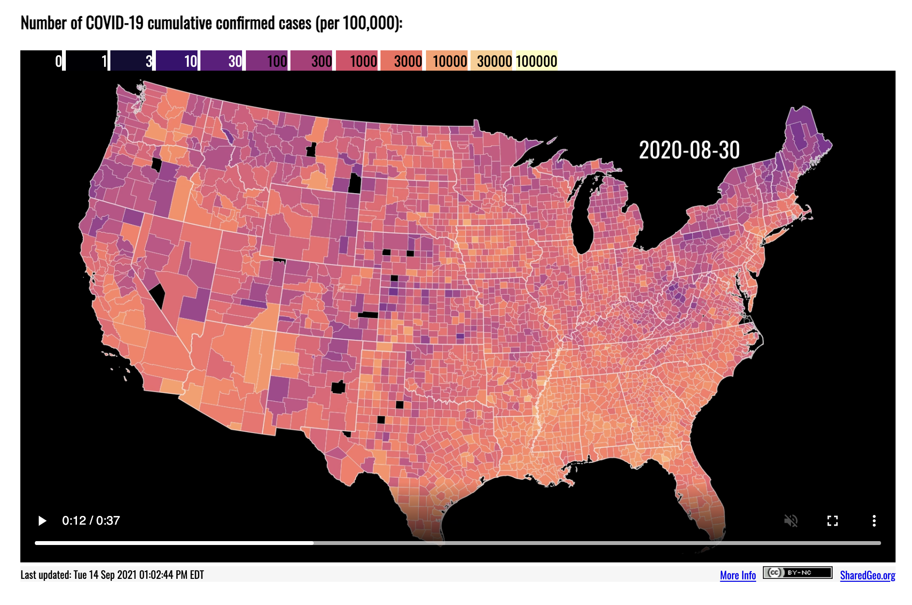

```{r load-packages, include = FALSE }
library(tidyverse)
```

## Announcements

- HW 01 due **TODAY at 11:59p**

- HW 02 due **Wednesday, September 20 at 11:59p**
  - focus on data wrangling & working with multiple data frames
  - Repos released later today

- Ed Discussion board for today's lecture: https://edstem.org/us/courses/8027/discussion/613186

- [Week 05](https://sta199-fa21-003.netlify.app/prepare/week-05.html) prepare
  - Prep Quiz 02 due Monday, September 20 at 1:45p

## Questions about HW 01 or prepare assignment? 


## Which visualization do you prefer? 

Below are two maps showing the cumulative confirmed COVID-19 cases as of August 30, 2020. The maps are snapshots of the interactive visualization on [www.sharedgeo.org/COVID-19](https://www.sharedgeo.org/COVID-19/).

If you're doing an analysis to understand COVID spread in the US, which map do you prefer? Why? Place your vote and reasoning on Ed Discussion: https://edstem.org/us/courses/8027/discussion/613213


### Map A: Number of COVID-19 cumulative confirmed cases



### Map B: Number of COVID-19 cumulative confirmed cases (per 100,000)




## AE 08: Visualizing spatial data - North Carolina

### Clone the repo + start a new project

- Go to the `ae-08-[GITHUB USERNAME]` rep in the GitHub course organization:  https://github.com/sta199-fa21-003

- Access the RStudio Docker containers at https://vm-manage.oit.duke.edu/containers

- See the [Lab 01 instructions](https://sta199-fa21-003.netlify.app/labs/lab-01-hello-r.html) for details on cloning the repo and starting a new project in RStudio. 


