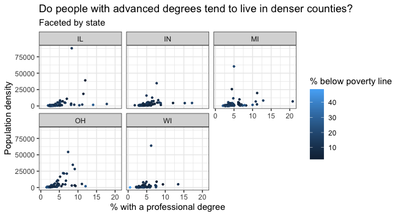

## Goals

In this lab, you will...

- learn how to effectively visualize numeric and categorical data.
- continue developing a workflow for reproducible data analysis.

## Getting started 

-   Go to the [**sta199-fa21-003**](https://www.github.com/sta199-fa21-003) organization on GitHub. Click on the repo with the prefix **lab-02**. It contains the starter documents you need to complete the lab.

- Clone the repo and start a new project in RStudio. See the [Lab 01 instructions] for details on cloning a repo, starting a new R project and configuring git. 

# Packages

We will use the We will be using **tidyverse** and **viridis** to create and customize plots in R. 

```{r load-packages, message = FALSE, echo = FALSE}
library(tidyverse)
library(viridis)
```

# Data: Let's take a trip to the Midwest

The data in this lab is in the `midwest` data frame. It is part of the ggplot2 R package, so the `midwest` data set is automatically loaded when you load the tidyverse package.

The data contains demographic characteristics of counties in the Midwest region of the United States.

Because the data set is part of the ggplot2 package, you can read documentation for the data set, including variable definitions by typing `?midwest` in the **console**.

# Exercises 

As we've discussed in lecture, your plots should include an informative title, axes should be labeled, and careful consideration should be given to aesthetic choices.

In addition, the code should exceed the 80 character limit, so that all the code can be read when you knit to PDF. To help with this, you can add a vertical line at 80 characters by clicking "Tools" 
$\rightarrow$ "Global Options" $\rightarrow$ "Code" $\rightarrow$ "Display", then set "Margin Column" to 80 and click "Apply".

Remember continuing to develop a sound workflow for reproducible data analysis is important as you complete the lab and other assignments in this course. To help you gauge this, you should have at least 3 informative commit message. There will be periodic reminders in this assignment to remind you to **knit, commit, and push** your changes.

1. Use a histogram to visualize the population density of counties. Set the binwidth to 10 and include axes labels and a title. 
  - Describe the shape of the distribution. 
  - Do there appear to be are any outliers? Briefly explain. 

::: {.commit}
`r emo::ji("yarn")` `r emo::ji("white_check_mark")` `r emo::ji("arrow_up")` Knit, commit, and push your changes to GitHub with the commit message "Added answer for Ex 1".
Make sure to commit and push all changed files so that your Git pane is cleared up afterwards.
:::


```{marginfigure}
See [*Introduction to the viridis color maps*](https://cran.r-project.org/web/packages/viridis/vignettes/intro-to-viridis.html) to read more about the viridis R package with code examples.  
```

2. Create a scatterplot of percentage of people with a college degree (`percollege`) versus percentage below poverty (`percbelowpoverty`) with points colored by `state`. Label the axes and legend and give the plot a title. Use the `scale_color_viridis` function to apply the viridis color palette to your plot. 

3. Describe what you observe in the plot from the previous exercise. In your description, include similarities and differences in the patterns across states. 

```{marginfigure}
`se = FALSE` removes the confidence bands around the line.
```

4. Now, let's examine the relationship between the same two variables, using a separate plot for each state. Label the axes and give the plot a title. Use `geom_smooth` with the argument `se = FALSE` to add a smooth curve fit to the data. Which plot do you prefer? Briefly explain your choice.

::: {.commit}
`r emo::ji("yarn")` `r emo::ji("white_check_mark")` `r emo::ji("arrow_up")` Now is another good time to knit, commit, and push your changes to GitHub with a meaningful commit message.
:::


5. *Do some states have counties that tend to be geographically larger than others?* To explore this question, create side-by-side boxplots of area (`area`) of a county based on state (`state`). 
  - Describe what you observe from the plot. 
  - Which state has the single largest county? How do you know based on the plot?

6. *Do some states have a higher percentage of their counties located in a metropolitan area?* Create a segmented bar chart with one bar per state and the fill determined by whether the state is located in a metropolitan area (`inmetro`). The y axis of the segmented barplot should range from 0 to 1. 
  - What do you notice from the plot?

::: {.commit}
`r emo::ji("yarn")` `r emo::ji("white_check_mark")` `r emo::ji("arrow_up")` Now is another good time to knit, commit, and push your changes to GitHub with a meaningful commit message.
:::


7. For this exercise, you should begin with the data wrangling code below. We will learn more about data wrangling code next week. 

```{r hint, eval = FALSE}
midwest |>
  mutate(metro = ifelse(inmetro == 1, "Yes", "No"))
```


Recreate the plot below. (Hints: [The `ggplot2` reference page](https://ggplot2.tidyverse.org/reference/ggtheme.html) will be helpful in determining the theme. The `size` of the points is 0.75.) 



::: {.commit}
`r emo::ji("yarn")` `r emo::ji("white_check_mark")` `r emo::ji("arrow_up")` Knit, commit, and push your final changes to GitHub with a meaningful commit message.
:::

# Submission

Once you are finished with the lab, you will submit the PDF document produced from your final *knit, commit, and push* to Gradescope.

**Before you wrap up the assignment, make sure all documents are updated on your GitHub repo. We will be checking these to make sure you have been practicing how to commit and push changes.** **Remember -- you must turn in a .pdf file to the Gradescope page by the submission deadline to be considered "on time".**

To submit your assignment:

-   Go to <http://www.gradescope.com> and click *Log in* in the top right corner.
-   Click *School Credentials* $\rightarrow$ *Duke NetID* and log in using your NetID credentials.
-   Click on your *STA 199* course.
-   Click on the assignment, and you'll be prompted to submit it.
-   Mark the pages associated with each exercise, 1 - 4. All of the papers of your lab should be associated with at least one question (i.e., should be "checked").
-   Select the first page of your .pdf submission to be associated with the *"Workflow & formatting"* section.

# Grading (50 pts)

<br>

| Component | Points |
|:----------|:-------|
| Ex 1      | 4      |
| Ex 2      | 6    |
| Ex 3      | 4    |
| Ex 4      | 8     |
| Ex 5      | 6      |
| Ex 6      | 6    |
| Ex 7      | 8    |
| Workflow & formatting   | 8      |

**Grading notes**:

-   The "Workflow & formatting" grade is to assess the reproducible workflow. This includes having at least 3 informative commit messages, labeling the code chunks, and having readable code that does not exceed 80 characters (i.e., we can read all your code in the knitted PDF.)

