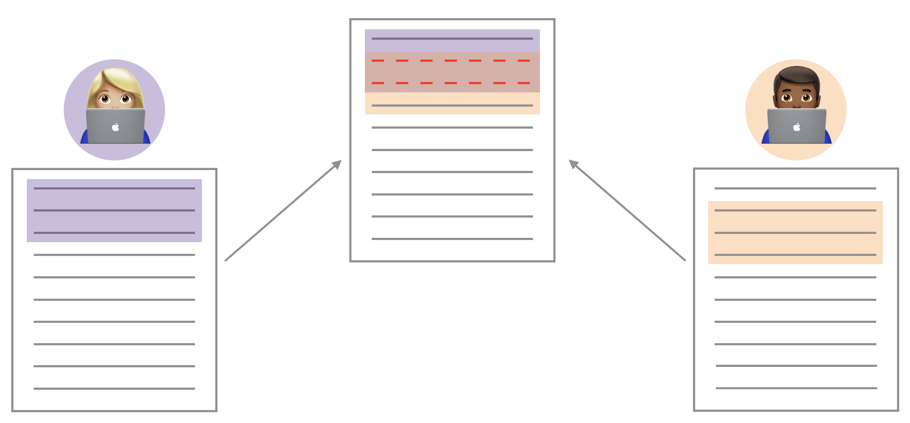

```{r include = FALSE}
knitr::opts_chunk$set(warning = FALSE, 
                      message = FALSE, 
                      eval = FALSE)
```


# Introduction 

The goal of today's lab is to practice visualizing and calculating probabilities using the tidyverse. Before we get to that, however, we will look at something that may happen as you collaborate with your lab team (or any other team!) in GitHub.

# Merge Conflicts (uh oh)


You may have seen this already through the course of your collaboration last 
week in Lab 03. When two collaborators make changes to a file and push the file 
to their repository, git merges these two files.




If these two files have conflicting content on the same line, git will produce a
**merge conflict**. Merge conflicts need to be resolved manually, as they require a human 
intervention:


To resolve the merge conflict, decide if you want to keep only your text, the 
text on GitHub, or incorporate changes from both texts. Delete the conflict 
markers `<<<<<<<`, `=======`, `>>>>>>>` and make the changes you want in the 
final merge.

**Assign numbers 1, 2, 3, and 4 to each of your team members** (if only 3 team 
members, just number 1 through 3). Go through the following steps in detail, 
which simulate a merge conflict. Completing this exercise will be part of the 
lab grade.

## Resolving a merge conflict

**Step 1: Everyone** Clone the repo with the prefix **merge-conflict** and open the .Rmd file.

**Team Member 4** should look at the group’s repo on GitHub.com to ensure that the other members’ files are pushed to GitHub after every step.

**Step 2: Team Member 1** Change the team name to your team name. *Knit, commit, and push*.

**Step 3: Member 2** Change the team name to something different (i.e., not your
team name). *Knit, commit, and push*. 

You should get an error.

**Pull** and review the document with the merge conflict. Read the error to your teammates. You can also show them the error by sharing your screen. A merge conflict occurred because you edited the same part of the 
document as Member 1. Resolve the conflict with whichever name you want to keep,
then knit, commit and push again.

**Step 4: Member 3** Write some narrative in the space provided. You should get an error.

This time, no merge conflicts should occur, since you edited a different part of
the document from Members 1 and 2. Read the error to your teammates. You can also show them the error by sharing your screen. 

Click to pull.  *Then, knit, commit, and push.* All merge conflicts should be resolved and all documents updated in the GitHub repo.

<u> You do not need to submit anything on Gradescope for the merge conflict activity.</u> 


