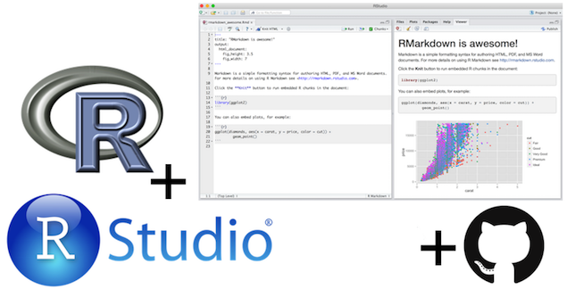
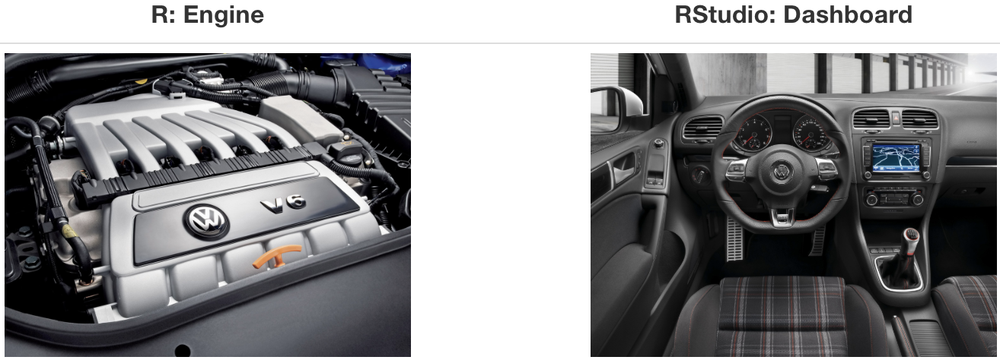

layout: true

<div class="my-footer">
<span>
<a href="http://datasciencebox.org" target="_blank">datasciencebox.org</a>
</span>
</div> 

---

```{r packages, echo=FALSE, message=FALSE, warning=FALSE}
library(tidyverse)
```

## Topics

- Reproducible data analysis 
- R and RStudio (Cloud)
- R Markdown 

---

class: center, middle

## Reproducible data analysis

---

## Reproducibility checklist

--

.vocab[Near-term goals]

`r emo::ji('heavy_check_mark')` Are the tables and figures reproducible from the code and data?

`r emo::ji('heavy_check_mark')` Does the code actually do what you think it does?

`r emo::ji('heavy_check_mark')` In addition to what was done, is it clear **why** it was done?

--

.vocab[Long-term goals]

`r emo::ji('heavy_check_mark')` Can the code be used for other data?

`r emo::ji('heavy_check_mark')` Can you extend the code to do other things?
---

## Toolkit

```{r fig.align="center",out.width="50%",echo=FALSE}

```


- **Scriptability** $\rightarrow$ R

- **Literate programming** (code, narrative, output in one place) $\rightarrow$ R Markdown

- **Organization/Collaboration** $\rightarrow$ RStudio Cloud

---

class: center, middle

# R and RStudio

---

## What is R and RStudio? 

- R is a statistical programming language

- RStudio is a convenient interface for R (an integrated development environment, IDE)

.pull-left[
- At its simplest:<sup>*</sup>
    - R is like a car’s engine
    - RStudio is like a car’s dashboard
]

.pull-right[
```{r fig.align="center",echo=FALSE}

```
]

.footnote[
*Source: [Modern Dive](https://moderndive.com/)
]

---

## R essentials (a short list)

- **Functions** are (most often) verbs, followed by what they will be applied to in parentheses:

```{r eval=FALSE}
do_this(to_this)
do_that(to_this, to_that, with_those)
```

--

- **Columns** (variables) in data frames are accessed with `$`:

```{r eval=FALSE}
dataframe$var_name
```

--

- **Packages** are installed with the `install.packages` function and loaded with the `library` function, once per session:

```{r eval=FALSE}
install.packages("package_name")
library(package_name)
```

---

## tidyverse

.pull-left[

```{r echo=FALSE, fig.align = "center"}
knitr::include_graphics("img/02/tidyverse-packages.png")
```
]

.pull-right[
- The [tidyverse](https://www.tidyverse.org/) is an **opinionated** collection of R packages designed for data science. 

<br> 

- All packages share an underlying philosophy and a common grammar. 
]

.footnote[
Image from [Teaching in the Tidyverse 2020](https://education.rstudio.com/blog/2020/07/teaching-the-tidyverse-in-2020-part-1-getting-started/)
]

---

class: center, middle

# R Markdown

---


## R Markdown

- Fully reproducible reports -- the analysis is run from the beginning each time you knit


- Simple [Markdown syntax](https://github.com/rstudio/cheatsheets/raw/master/rmarkdown-2.0.pdf) for text


- Code goes in chunks, defined by three backticks, narrative goes outside of chunks

---

## How will we use R Markdown?

- Every assignment / lab / project / etc. is an R Markdown document


- You'll always have a template R Markdown document to start with


- The amount of scaffolding in the template will decrease over the semester

---

## R Markdown tips

**Resources**
- [R Markdown cheat sheet](https://github.com/rstudio/cheatsheets/raw/master/rmarkdown-2.0.pdf)
- Markdown Quick Reference: 
    - `Help -> Markdown Quick Reference`
<br><br>
--


**Remember**: The workspace of the R Markdown document is <u>separate</u> from the console

---

## Recap 

Can you answer these questions? 

- What is a reproducible data analysis, and why is it important?
- What is version control, and why is it important?
- What is R vs. RStudio? 
- What is git vs. GitHub? 
