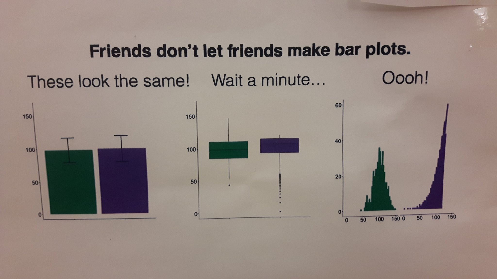

```{r load-packages, include = FALSE }
library(tidyverse)
```

## Announcements

- Thursday's labs will all be online. You can find the Zoom link for your lab session under the **Zoom Meetings** tab in Sakai. 

- Office hours started this week. Schedule available on the [syllabus](https://sta199-fa21-003.netlify.app/syllabus/).
  - In-person and online office hours held as usual. 

- Complete [All About You survey](https://duke.qualtrics.com/jfe/form/SV_1M8MJovNzBNyMYK) **today**

- [Week 03](https://sta199-fa21-003.netlify.app/prepare/week-03.html) prepare

- Lab 01: accepted until Sep 02 at 11:59p with no late penalty 

## Identify variable type (Ed Discussion poll)

- Favorite food
- Number of classes you're taking this semester
- Zip code

## The way data is displayed matters

```{r echo = F, out.width = "70%", fig.align = "center", fig.cap = "Source: [Twitter](https://twitter.com/CoralTKrueger/status/1296425438403796992)"}

```

## Questions from the prepare assignment? 

## AE 04: Visualizing Star Wars, cont'd

### Clone a repo + start a new project

- Go to the `ae-04-[GITHUB USERNAME]` rep in the GitHub course organization:  https://github.com/sta199-fa21-003

- Access the RStudio Docker containers at https://vm-manage.oit.duke.edu/containers

- See the [Lab 01 instructions](https://sta199-fa21-003.netlify.app/labs/lab-01-hello-r.html) for details on cloning the repo and starting a new project in RStudio. 


