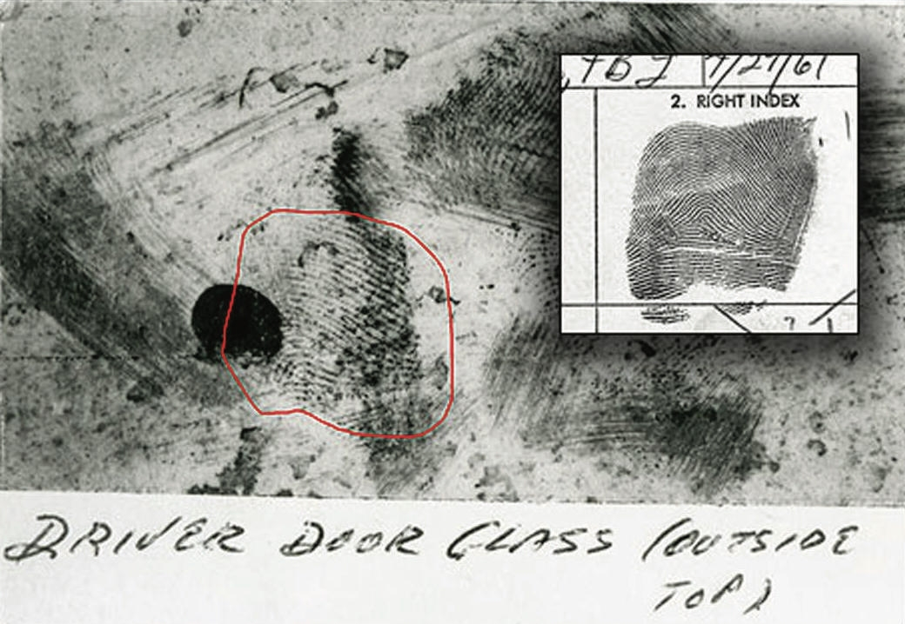

```{r child = "setup.Rmd"}
```

```{r echo=FALSE, message=FALSE, warning=FALSE}
library(tidyverse)
library(rvest)
```

class: center, middle

# Welcome!

---

## Meet the teaching team: Instructor 


### Prof. Maria Tackett

.pull-left[
```{r, echo=FALSE,out.width = '75%'} 
knitr::include_graphics("img/01/capital-one-logo.jpg")
```

```{r, echo=FALSE,out.width = '75%'} 

```

]

.pull-right[
```{r, echo=FALSE,out.width = '75%'} 
knitr::include_graphics("img/01/education.jpg")
```
]

---

## Meet the teaching team: TAs

- Olivier Binette

- Meredith Brown

- Carson Garcia

- Rob Kravec

- Shirley Mathur

- Manny Mokel

- Margaret Reed

- Camilla Yu 

---

## Check in on Ed Discussion

- Go to the class Ed Discussion: [edstem.org/us/courses/8027/discussion](https://edstem.org/us/courses/8027/discussion/)

- Answer the poll question: **How's it going?**

---

class: middle, center

# Data Science

---

## What is data science?

- Data science is an exciting discipline that allows you to turn raw data into understanding, insight, and knowledge.

- We're going to learn to do this in a `tidy` way -- more on that later!

- This is a course on introduction to data science, with an emphasis on statistical thinking.

---

## Course FAQ

**Q - What data science background does this course assume?**
A - None.

<br>

**Q - Is this an intro stat course?**
A - While statistics $\neq$ data science, they are very closely related and have tremendous of overlap. Hence, this course is a great way to get started with statistics. However this course is not your typical high school statistics course.

<br>

**Q - Will we be doing computing?**
A - Yes. We will use the computing language R.

---

## Course learning objectives

- Learn to explore, visualize, and analyze data in a *reproducible* and *shareable* manner

- Gain experience in data wrangling, exploratory data analysis, predictive modeling, and data visualization

- Work on problems and case studies inspired by and based on *real-world questions* and data

- Learn to effectively communicate results through written assignments and final project presentation

---

## Some of what you will learn

.pull-left[
- Fundamentals of `R`

- Data visualization and wrangling with `ggplot2` and `dplyr` from the `tidyverse`

- Web scraping

- Web based applications with `RShiny`

- Spatial data visualization

]

.pull-right[
- Data types and functions

- Version control with `GitHub`

- Reproducible reports with `R Markdown`

- Regression and classification

- Statistical inference
]

---

## Examples of data science in practice

- [Apple Mobility Trends](https://covid19.apple.com/mobility)

- [What redisctricting looks like in every state](https://projects.fivethirtyeight.com/redistricting-2022-maps/)

- [Tracking their life via Fitbit](https://livefreeordichotomize.com/2017/12/27/a-year-as-told-by-fitbit/)

- [US Spread of COVID-19 maps and analytics](https://www.sharedgeo.org/COVID-19/)

---

class: middle, center

# The Course

---

## Course Toolkit

**Course Website:** [sta199-fa21-003.netlify.app](https://sta199-fa21-003.netlify.app)
  - Central hub for the course!
  - Quick tour of the website

**Sakai** [sakai.duke.edu](https://sakai.duke.edu)
  - Gradebook
  
**Ed Discussion**: [edstem.org/us/courses/8027/discussion](https://edstem.org/us/courses/8027/discussion/)
  - Class Q&A and discussion forum

**GitHub:** [github.com/sta199-fa21-003](https://github.com/sta199-fa21-003)
  - Distribute & work on assignments -- more on this later!

---

## Activities: Prepare, Practice, Perform

- **Prepare**: introduce new content and prepare for lectures
  - Videos & readings before lecture
  - Low-stakes prep quizzes on basic definitions & concepts from videos
  - See *Prepare* column on course schedule 


- **Practice**: practice applying statistical concepts and computing
  - Application Exercises (AE) during lecture
  - Graded for completion 

---

## Activities: Prepare, Practice, Perform

- **Perform**: Put together what you've learned to analyze real-world data
  -  Weekly team or individual lab assignments
  -  Periodic individual homework assignments
  -  Two take-home exams
  -  Final team project presented during the final exam period.

---

## Where to find help

--

- Attend .vocab[Office hours] to meet with a member of the teaching team.
  - Full office hours begin August 30

--

- Use **Ed Discussion** for general questions about course content and/or assignments, since other students may benefit from the response.

--

- Use email for questions regarding personal matters and/or grades.

---

## Academic Resource Center

The [Academic Resource Center (ARC)](https://arc.duke.edu/) offers free services to all students during their undergraduate careers at Duke. 

Services include 
  - Learning Consultations
  - Peer Tutoring and Study Groups
  - ADHD/LD Coaching, Outreach Workshops
  - and more. 

  
Contact the ARC at [ARC@duke.edu](mailto:arc@duke.edu) or call 919-684-5917 to schedule an appointment. 

---

## CAPS

[Duke Counseling & Psychological Services (CAPS)](https://studentaffairs.duke.edu/caps) helps Duke Students enhance strengths and develop abilities to successfully live, grow and learn in their personal and academic lives. 

Services include 
- brief individual and group counseling
- couples counseling
- outreach to student groups
- and more...

---

## Course community & Learning environment

--

- Uphold the Duke Community Standard: 
> - I will not lie, cheat, or steal in my academic endeavors;
>- I will conduct myself honorably in all my endeavors; and
> - I will act if the Standard is compromised.

--

- Respect, honor, and celebrate our diverse community 

--

- Learning environment that is welcoming, inclusive, and accessible to everyone

---

## Attending lectures and labs

- You are expected to attend and participate lectures and labs

- Please wear a mask to help protect your peers and others around you `r emo::ji("mask")`

- **Please do not come to class if you have symptoms related to COVID-19, have had a known exposure to COVID-19, or have tested positive for COVID-19.**
  - You will still have access to AEs and labs to complete remotely 
  - Online office hours and Ed Discussion are available to ask questions
  - Email Professor Tackett if further arrangements needed
  
---

class: middle, center

# Questions? 

**Raise your hand or post on Ed Discussion**

---

class: middle, center

# Your turn!

---

## Create a GitHub account

Go to https://github.com/, and create an account (unless you already have one). 

After you create your account, go to [bit.ly/sta199-fa21-github](https://bit.ly/sta199-fa21-github) and enter your Duke email address (NETID@duke.edu) and GitHub username. 

<small>
Some tips from [Happy Git with R](http://happygitwithr.com/github-acct.html#username-advice).
</small>

- <small>Incorporate your actual name!</small>
- <small> Reuse your username from other contexts if you can, e.<small> g., Twitter or Slack.</small>
- <small> Pick a username you will be comfortable revealing to your future boss.</small>
- <small> Be as unique as possible in as few characters as possible. Shorter is better than longer.</small>
- <small> Make it timeless.</small>
- <small> Avoid words with special meaning in programming (e.g. `NA`).</small>

```{r echo = F}
countdown::countdown(minutes = 5, seconds = 0)
```

---

# Let's look at some data!

- Let's take a look at the [UN Votes](https://sta199-fa21-003.netlify.app/appex/appex01-unvotes.html) analysis.

- You may discuss with your neighbor. (Don't forget to introduce yourself first!)

- Type your answers under the **August 23 - UN Votes** thread on Ed Discussion

```{r echo = F}
countdown::countdown(minutes = 5, seconds = 0)
```

---

## For Wednesday

- We'll start talking about the computing toolkit

- Watch videos for [Prepare: Week 01](https://sta199-fa21-003.netlify.app/prepare/week-01.html)

-  Reserve an **STA198-199 RStudio container**. 
  - Go to https://vm-manage.oit.duke.edu/containers
  - Click **Reserve Container** for the STA198-199 container

- Submit your [GitHub username](https://bit.ly/sta199-fa21-github)

- Bring laptop/tablet/Chromebook to class 

- Complete the [All About You survey](https://duke.qualtrics.com/jfe/form/SV_1M8MJovNzBNyMYK)  (by Wed, Sep 01)


