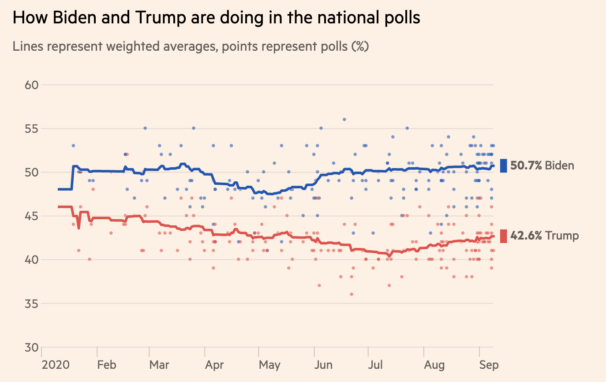

```{r child = "setup.Rmd"}
```

```{r packages, echo=FALSE, message=FALSE, warning=FALSE}
library(tidyverse)
library(broom)
library(knitr)
library(DT)
library(emo)
library(openintro)
library(infer)
library(patchwork)
knitr::opts_chunk$set(warning = FALSE, message = FALSE)
```

class: center, middle

# Inference

---

## Terminology

**Population**: a group of individuals or objects we are interested in studying

**Parameter**: a numerical quantity derived from the population
(almost always unknown)

If we had data from every unit in the population, we could just calculate 
population parameters and be done!

--

Unfortunately, we usually cannot do this, so we draw conclusions from

**Sample**: a subset of our population of interest

**Statistic**: a numerical quantity derived from a sample

---

## Inference

If the sample is **representative**, then we can use the tools of probability and statistical inference to make .vocab[generalizable] conclusions to the broader population of interest.


```{r echo=FALSE, out.width=406, out.height= 234, fig.align="center"}

```

Similar to tasting a spoonful of soup while cooking to make an inference about the entire pot.

---

## Statistical inference

**Statistical inference** is the process of using sample data to make 
  conclusions about the underlying population the sample came from.

- **Estimation**: using the sample to estimate a plausible range of values for the unknown parameter

- **Testing**: evaluating whether our observed sample provides evidence 
for or against some claim about the population

Today we will focus on **estimation**.

---

class: center, middle

# Estimation

---

## Let's \*virtually\* go to Asheville! 

.center[


**How much should we expect to pay for an Airbnb in Asheville?**
]

---

## Asheville data

[Inside Airbnb](http://insideairbnb.com/) scraped all Airbnb listings in 
Asheville, NC, that were active on June 25, 2020.

**Population of interest**: listings in the Asheville with at least ten reviews.

**Parameter of interest**: Mean price per guest per night among these 
listings.

.question[
What is the mean price per guest per night among Airbnb rentals in June 2020, 
among Airbnbs with at least ten reviews in Asheville (zip codes 28801 - 28806)?
]

We have data on the price per guest (`ppg`) for a random
sample of 50 Airbnb listings.

---

## Point estimate

A **point estimate** is a single value computed from the sample data to serve
as the "best guess", or estimate, for the population parameter. 

```{r}
abb <- read_csv("data/asheville.csv")

abb |> 
  summarize(mean_price = mean(ppg))
```

---

## Visualizing our sample

```{r, echo = F, out.width = "60%"}
ggplot(data = abb, aes(ppg)) +
  geom_histogram(binwidth = 25,
                 color = "darkblue",
                 fill = "skyblue") +
  labs(title = "Right-skewed distribution of price per guest",
       x = "Price per guest per night",
       y = "Count") +
  scale_y_continuous(breaks = seq(0, 20, by = 5)) + 
  ylim(0, 20) +
  theme_minimal()
```

---

.question[
If you want to catch a fish, do you prefer a spear or a net?
]

.pull-left[
```{r echo=FALSE, out.width=400, fig.align="center"}
knitr::include_graphics("img/14/spear.png")
```
]
.pull-right[
```{r echo=FALSE, out.width=400, fig.align="center"}

```
]

---

.question[
If you want to estimate a population parameter, do you prefer to report a range 
of values the parameter might be in, or a single value?
]

.pull-left[
```{r echo=FALSE, out.width=400, fig.align="center"}
knitr::include_graphics("img/14/spear.png")
```
]
.pull-right[
```{r echo=FALSE, out.width=400, fig.align="center"}

```
]

---

.question[
If you want to estimate a population parameter, do you prefer to report a range of values the parameter might be in, or a single value?
]

--

- If we report a point estimate, we probably won’t hit the exact population 
parameter.

- If we report a range of plausible values we have a good shot at capturing 
the parameter.

---

```{r echo=FALSE, out.width = "70%", fig.align="center"}

```

.footnote[
Source: [Biden vs Trump: who is leading the 2020 US election polls?](https://ig.ft.com/us-election-2020/), 10 Sep 2020.
]


---

class: middle, center

## Confidence intervals

---

## Confidence intervals 

- A plausible range of values for the population parameter is a **confidence interval**.

- In order to construct a confidence interval we need to quantify the variability of our sample statistic

- For example, if we want to construct a confidence interval for a population mean, we need to come up with a plausible range of values around our observed sample mena

- This range will depend on how precise and how accurate our sample mean is as an estimate of the population mean

- Quantifying this requires a measurement of how much we would expect the sample population to vary from sample to sample

---

.question[
Suppose we split the class in half and ask each student their height. Then, we calculate the mean height of students 
on each side of the classroom. Would you expect these two means to be exactly 
equal, close but not equal, or wildly different?
]

--

<br><br>

.question[
Suppose you randomly sample 50 students and 5 of them are left handed. If you 
were to take another random sample of 50 students, how many would you expect to 
be left handed? Would you be surprised if only 3 of them were left handed? Would 
you be surprised if 40 of them were left handed?
]

---

## Quantifying the variability

We can quantify the variability of sample statistics using different approaches:

- **Simulation**: via bootstrapping or "resampling" techniques (**today's focus**)

or

- **Theory**: via the Central Limit Theorem (**coming soon!**)

---

class: center, middle

# Bootstrapping

---

## The bootstrap principle


- The term **bootstrapping** comes from the phrase "pulling oneself up by one’s 
bootstraps", which is a metaphor for accomplishing an impossible task without 
any outside help.

- **Impossible task**: estimating a population parameter using data from only the given sample.

- **Note**: This notion of saying something about a population parameter using 
only information from an observed sample is the crux of statistical inference,  it is not limited to bootstrapping.

---

## The bootstrap procedure

1. Take a **bootstrap sample** - a random sample taken *<u> with replacement</u>* from the original sample, *<u>of the same size</u>* as the original sample.

2. Calculate the bootstrap statistic: the statistic you’re interested in (the 
mean, the median, the correlation, etc.) computed on the bootstrap sample.

3. Repeat steps (1) and (2) many times to create a .vocab[bootstrap distribution] - a distribution of bootstrap statistics.

4. Calculate the bounds of the XX% confidence interval as the middle XX% of the bootstrap distribution.

---

## The original sample

```{r, echo = F, out.width = "60%"}
ggplot(data = abb, aes(ppg)) +
  geom_histogram(binwidth = 25,
                 color = "darkblue",
                 fill = "skyblue") +
  labs(caption = "Original sample",
       x = "Price per guest per night",
       y = "Count") +
  scale_y_continuous(breaks = seq(0, 20, by = 5)) + 
  ylim(0, 20) +
  scale_x_continuous(breaks = seq(0, 250, by = 50)) + 
  xlim(0, 250) +
  geom_vline(xintercept = mean(abb$ppg), lwd = 2, color = "red") + 
  theme_minimal()
```

---

## Step-by-step

**Step 1.** Take a **bootstrap sample**: a random sample taken 
*<u>with replacement</u>* from the original sample, *<u>of the same size</u>* as the 
original sample:

```{r, echo = F}
set.seed(1)
indices <- sample(1:nrow(abb), 50, replace = T)

boot_samp_1 <- abb |> 
  slice(indices)
```

```{r, echo = F, out.width = "60%"}
ggplot(data = boot_samp_1, aes(ppg)) +
  geom_histogram(binwidth = 25,
                 color = "darkblue",
                 fill = "skyblue") +
  labs(caption = "Bootstrap sample 1",
       x = "Price per guest per night",
       y = "Count") +
  scale_y_continuous(breaks = seq(0, 20, by = 5)) + 
  ylim(0, 20) +
  scale_x_continuous(breaks = seq(0, 250, by = 50)) + 
  xlim(0, 250) +
# geom_vline(xintercept = mean(boot_samp_1$ppg), lwd = 2, color = "red") + 
  theme_minimal()
```

---

## Step-by-step

**Step 2.** Calculate the bootstrap statistic (in this case, the sample mean) 
using the bootstrap sample:

```{r, echo = F, out.width = "60%"}
ggplot(data = boot_samp_1, aes(ppg)) +
  geom_histogram(binwidth = 25,
                 color = "darkblue",
                 fill = "skyblue") +
  labs(caption = "Bootstrap sample 1",
       x = "Price per guest per night",
       y = "Count") +
  scale_y_continuous(breaks = seq(0, 20, by = 5)) + 
  ylim(0, 20) +
  scale_x_continuous(breaks = seq(0, 250, by = 50)) + 
  xlim(0, 250) + 
  geom_vline(xintercept = mean(boot_samp_1$ppg), lwd = 2, color = "red") + 
  theme_minimal()
```

---

## Step-by-step

**Step 3.** Do steps 1 and 2 over and over again to create a bootstrap 
distribution of sample means:

.pull-left[
```{r, echo = F}
set.seed(1)

temp <- abb |> slice(sample(1:50, replace = T))
samp1 <- ggplot(data = temp, aes(ppg)) +
  geom_histogram(binwidth = 25, color = "darkblue", fill = "skyblue") +
  labs(x = "", y = "") +
  scale_y_continuous(breaks = seq(0, 20, by = 5)) + 
  ylim(0, 20) +
  scale_x_continuous(breaks = seq(0, 250, by = 50)) + 
  xlim(0, 250) +
  geom_vline(xintercept = mean(temp$ppg), lwd = 1, color = "red") + 
  theme_minimal()
```

```{r, echo = F}
set.seed(2)

temp <- abb |> slice(sample(1:50, replace = T))
samp2 <- ggplot(data = temp, aes(ppg)) +
  geom_histogram(binwidth = 25, color = "darkblue", fill = "skyblue") +
  labs(x = "", y = "") +
  scale_y_continuous(breaks = seq(0, 20, by = 5)) + 
  ylim(0, 20) +
  scale_x_continuous(breaks = seq(0, 250, by = 50)) + 
  xlim(0, 250) +
  geom_vline(xintercept = mean(temp$ppg), lwd = 1, color = "red") + 
  theme_minimal()
```
]

.pull-right[
```{r, echo = F}
set.seed(3)

temp <- abb |> slice(sample(1:50, replace = T))
samp3 <- ggplot(data = temp, aes(ppg)) +
  geom_histogram(binwidth = 25, color = "darkblue", fill = "skyblue") +
  labs(x = "", y = "") +
  scale_y_continuous(breaks = seq(0, 20, by = 5)) + 
  ylim(0, 20) +
  scale_x_continuous(breaks = seq(0, 250, by = 50)) + 
  xlim(0, 250) +
  geom_vline(xintercept = mean(temp$ppg), lwd = 1, color = "red") + 
  theme_minimal()
```

```{r, echo = F}
set.seed(4)

temp <- abb |> slice(sample(1:50, replace = T))
samp4 <- ggplot(data = temp, aes(ppg)) +
  geom_histogram(binwidth = 25, color = "darkblue", fill = "skyblue") +
  labs(x = "", y = "") +
  scale_y_continuous(breaks = seq(0, 20, by = 5)) + 
  ylim(0, 20) +
  scale_x_continuous(breaks = seq(0, 250, by = 50)) + 
  xlim(0, 250) +
  geom_vline(xintercept = mean(temp$ppg), lwd = 1, color = "red") + 
  theme_minimal()
```
]

```{r echo = F, out.width = "60%"}

(samp1 + samp3) / (samp2 + samp4)
```
              
---

## Step-by-step

**Step 3.** In this plot, we've taken 500 bootstrap samples, calculated the
sample mean for each, and plotted them in a histogram:

```{r, echo = F, out.width = "60%"}
boot_dist <- tibble(boot_mean = numeric(500))
for(i in 1:500){
  set.seed(i)
  indices <- sample(1:50, replace = T)
  boot_dist$boot_mean[i] <- mean(abb$ppg[indices])
}

ggplot(data = boot_dist, aes(boot_mean)) +
  geom_histogram(binwidth = 5, color = "darkred", fill = "pink") +
  labs(x = "", y = "") +
  scale_x_continuous(breaks = seq(0, 250, by = 50)) + 
  xlim(0, 250) +
  theme_minimal()
```

---

**Here we compare the bootstrap distribution of sample means to that 
of the original data. What do you notice?**

```{r, echo = F, out.width = "60%"}

boot_dist <- tibble(boot_mean = numeric(500))
for(i in 1:500){
  set.seed(i)
  indices <- sample(1:50, replace = T)
  boot_dist$boot_mean[i] <- mean(abb$ppg[indices])
}

p1 <- ggplot(data = abb, aes(ppg)) +
  geom_histogram(binwidth = 25,
                 color = "darkblue",
                 fill = "skyblue") +
  labs(x = "", y = "", title = "Original sample") +
  scale_y_continuous(breaks = seq(0, 20, by = 5)) + 
  ylim(0, 20) +
  scale_x_continuous(breaks = seq(0, 250, by = 50)) + 
  xlim(0, 250) +
  geom_vline(xintercept = mean(abb$ppg), lwd = 2, color = "red") + 
  theme_minimal() +
  theme(axis.title.y=element_blank(),
        axis.text.y=element_blank(),
        axis.ticks.y=element_blank())

p2 <- ggplot(data = boot_dist, aes(boot_mean)) +
  geom_histogram(binwidth = 5, color = "darkred", fill = "pink") +
  labs(x = "", y = "", title = "Bootstrap distribution of sample means") +
  scale_x_continuous(breaks = seq(0, 250, by = 50)) + 
  xlim(0, 250) +
  theme_minimal() +
  theme(axis.title.y=element_blank(),
        axis.text.y=element_blank(),
        axis.ticks.y=element_blank())

p1 / p2
```

---

## Step-by-step

**Step 4.** Calculate the bounds of the bootstrap interval by using percentiles of the bootstrap distribution

```{r, echo = F, out.width = "60%"}
boot_dist <- tibble(boot_mean = numeric(500))
for(i in 1:500){
  set.seed(i)
  indices <- sample(1:50, replace = T)
  boot_dist$boot_mean[i] <- mean(abb$ppg[indices])
}

ggplot(data = boot_dist, aes(boot_mean)) +
  geom_histogram(binwidth = 5, color = "darkred", fill = "pink") +
  labs(x = "", y = "") +
  scale_x_continuous(breaks = seq(0, 250, by = 50)) + 
  xlim(0, 250) +
  geom_vline(xintercept = quantile(boot_dist$boot_mean, 0.025), 
             lwd = 1, color = "black") +
  geom_vline(xintercept = quantile(boot_dist$boot_mean, 0.975), 
             lwd = 1, color = "black") +
  theme_minimal()
```

---


## Interpreting a confidence interval


```{r, echo = F, out.width = "60%"}
boot_dist <- tibble(boot_mean = numeric(500))
for(i in 1:500){
  set.seed(i)
  indices <- sample(1:50, replace = T)
  boot_dist$boot_mean[i] <- mean(abb$ppg[indices])
}

ggplot(data = boot_dist, aes(boot_mean)) +
  geom_histogram(binwidth = 5, color = "darkred", fill = "pink") +
  labs(x = "", y = "") +
  scale_x_continuous(breaks = seq(0, 250, by = 50)) + 
  xlim(0, 250) +
  geom_vline(xintercept = quantile(boot_dist$boot_mean, 0.025), 
             lwd = 1, color = "black") +
  geom_vline(xintercept = quantile(boot_dist$boot_mean, 0.975), 
             lwd = 1, color = "black") +
  theme_minimal()
```

Using the 2.5th and 97.5th quantiles as bounds for our confidence interval gives 
us the middle 95% of the bootstrap means. Our 95% CI is 
(`r round(quantile(boot_dist$boot_mean,0.025),2)`, `r round(quantile(boot_dist$boot_mean,0.975),2)`). What does this interval tell us?


---

## Interpretation 

.question[
The 95% confidence interval is `r round(quantile(boot_dist$boot_mean,0.025),2)` to `r round(quantile(boot_dist$boot_mean,0.975),2)`. What is the correct interpretation for this interval? 
]

**A** There is a 95% probability the mean price per night for an Airbnb in Asheville is between `r round(quantile(boot_dist$boot_mean,0.025),2)` and `r round(quantile(boot_dist$boot_mean,0.975),2)`. 

**B** There is a 95% probability the price per night for an Airbnb in Asheville is between `r round(quantile(boot_dist$boot_mean,0.025),2)` and `r round(quantile(boot_dist$boot_mean,0.975),2)`. 

**C** We are 95% confident the mean price per night for Airbnbs in Asheville is between `r round(quantile(boot_dist$boot_mean,0.025),2)` and `r round(quantile(boot_dist$boot_mean,0.975),2)`. 

**D** We are 95% confident the price per night for an Airbnb in Asheville is between `r round(quantile(boot_dist$boot_mean,0.025),2)` and `r round(quantile(boot_dist$boot_mean,0.975),2)`. 

